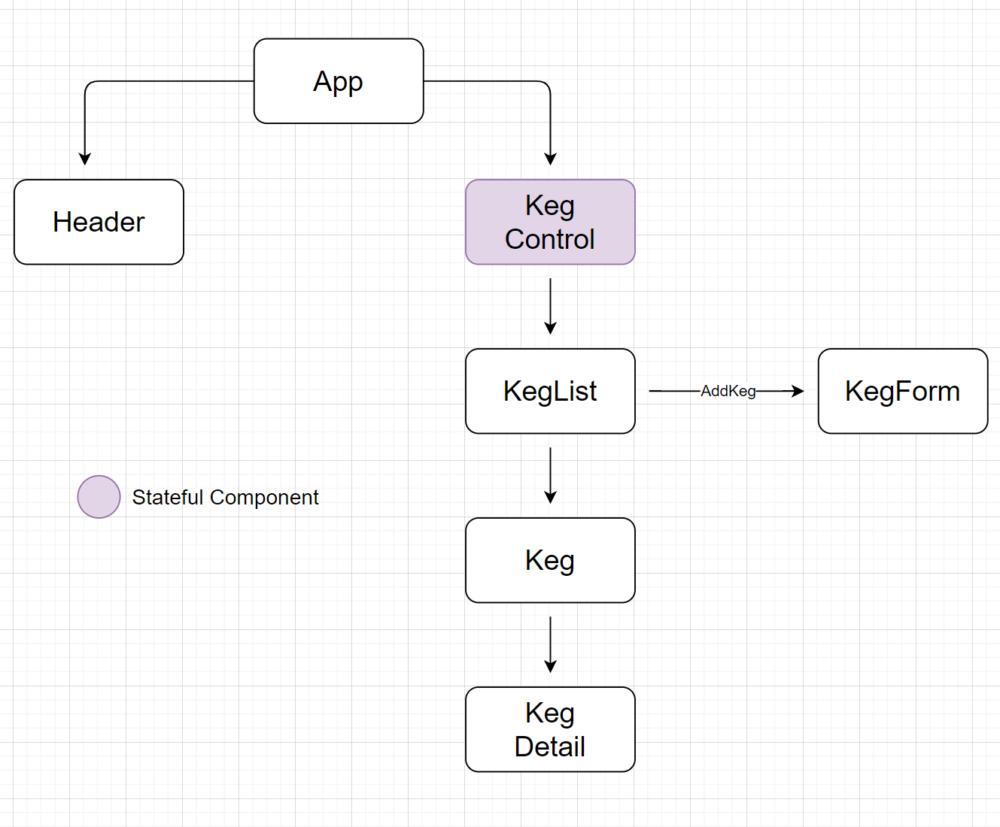

# _Tawnee's Tap House_

#### _React Solo Project for Epicodus_
#### _DATE 02.12.2021_

#### By _**Tawnee Harris**_

## Description

This application will allow a user to keep track of the kegs in their tap house. New kegs can be added with the number of pints left tracked. Keg details will also be available.

## Setup/Installation Requirements

Software Requirements
* An internet browser of your choice; I prefer Chrome
* A code editor; I prefer VSCode

Open by Downloading or Cloning
* Navigate to <GITHUB REPO URL>
* Download this repository to your computer by clicking the green Code button and 'Download Zip'
* Or clone the repository

Setup Instructions 
* After the repository is on your computer, navigate to the terminal and type in `npm install --save-exact react-scripts@3.2.0`
* Next, `npm start`
* View the page in the live server that opens

## React Component Tree

## Known Bugs

This application has no known bugs. 

## Support and contact details

Please feel free to reach out to me anytime at <tawneeh@icloud.com>

## Technologies Used -- DOES THIS NEED TO BE UPDATED?

* React
* JavaScript
* JSX
* Webpack
* Babel
* Eslint
* Created using `create-react-app`

### License

Copyright (c) 2021 **_Tawnee Harris_**